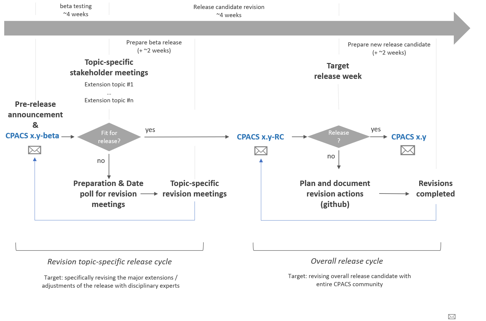
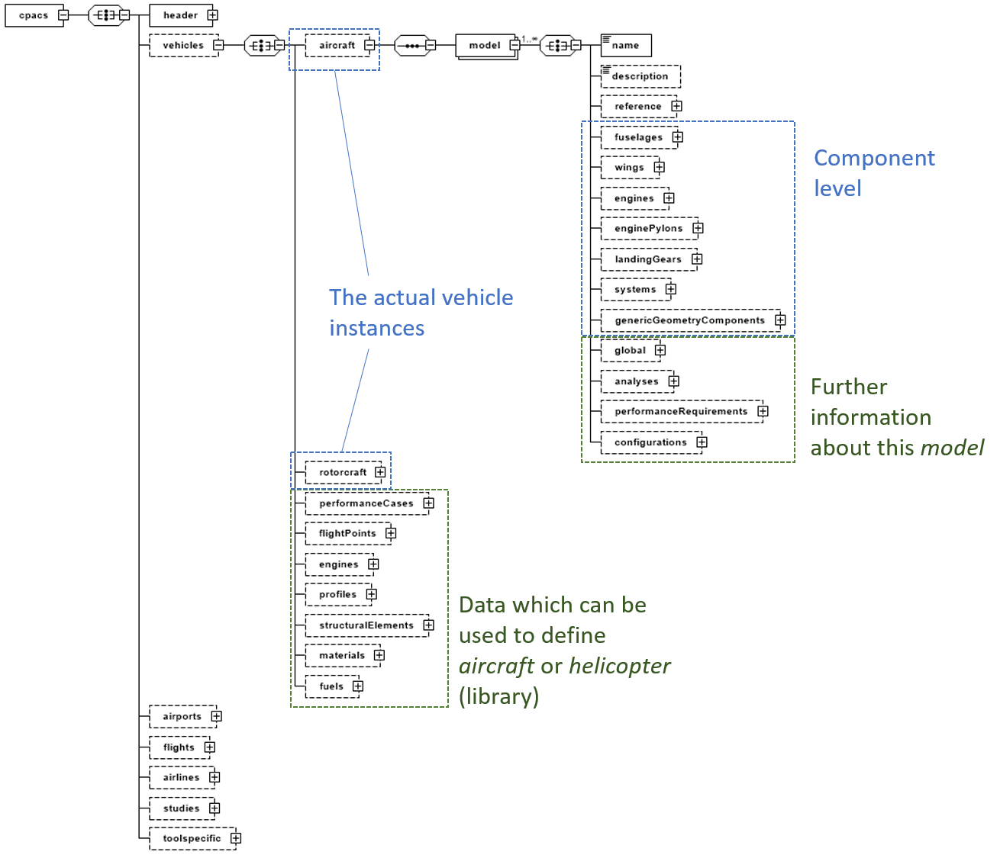
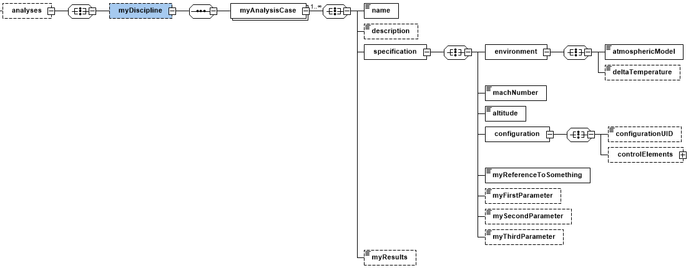

# CPACS Development

## Organizing Branches
The developments of CPACS follows the Gitflow workflow as described in [https://www.atlassian.com/git/tutorials/comparing-workflows/gitflow-workflow](https://www.atlassian.com/git/tutorials/comparing-workflows/gitflow-workflow "https://www.atlassian.com/git/tutorials/comparing-workflows/gitflow-workflow"). For the developments there are two main branches. While the *master* branch is used for keeping track of the official releases, the *develop* branch is used to combine all the developments and thus contains the main development version. All Feature branches are merged into the *develop* branch.

## Development Process

The purpose of this text is to describe the way CPACS should be developed in between releases. To learn more about the actual release process please look up the corresponding file. 

All developments concerning CPACS should be documented in a public issue tracker. Please note, that this is currently carried out on the github site after the move from googlecode.

Some guidelines for the CPACS development process: 

- Each issue should be marked with a target version. 
- Before implementation, each issue should be checked for conflicts with other parts of the parametrization. 
- No issue shall be implemented without documentation in the CPACS schema file!!!
- Redundancy in the CPACS schema should be avoided by all means. 
- If a multi-fidelity definition is requested, then it should occur on different levels of the schema to prohibit redundancy, e.g. massBreakdown. 


In general the inclusion of new items should work more or less in this order: 

1. Open issue and specify targets
2. Gather all "stakeholders" and start discussion process. In a best case, one of the stakeholders provides an initial proposal as a baseline for further discussions. 
3. Note the state of the discussion in the issue file. 
4. Prototype implementation in CPACS schema
5. Final implementation including documentation
6. Issue closed and feature marked for target version of CPACS


Incoming issues from outside the development team should be checked before beeing accepted.
The following questions should be answered:

- What is the driver for the requested change?
- If new definitions shall be implemented: Is there an immediate plan to exchange the data between different parties? Don't waste time on the definition of nodes which might not be used for data exchange.

## Release Process

The release process serves to inform all stakeholders and, if necessary, to involve their ideas and requirements in further revisions. For this purpose, preliminary versions are released before the final release. These are:

- **Beta releases**: These releases include all modifications and enhancements from the development process. As a prototype they are intended to be tested in practice. Depending on practical experience, further changes can be flexibly incorporated. 
- **Release candidates (RC)**: A RC is close to the final version and major adjustments should be avoided. This means that the RC serves as a final review for the official release.   

The following figure illustrates the iterative release process:




## Contribution Guidelines
TODO


## Development Guidelines
We will try to find/define some guidelines for decisions on how to structure CPACS.

First loose collection:

- Always use SI and accepted derived units
- Use the CPACS coordinate system for describing data (Do not introduce new coordinate systems if not absolutely neccessary)

### Redundancy
What do we mean by *redundancy*? Is the repeated specification of data such as `cpacs/vehicles/flightPoints/flightPoint` (atmosphere, altitude, velocity) critical if it would be included in an analysis node itself? A set of velocity/altitude itself is not a property dedicated to a specific `aircraft`/`rotorcraft` per se, thus making it a vehicle independent information would be reasonable. Therefore, (1st) the information could theoretically be outsourced to higher hierarchy levels (`cpacs` or `cpacs/vehicles`) and (2nd) a multiple specification of this information does not fall within the scope of data redundancy. Although the above example fulfills both requirements, should we always split the data into different hierarchical levels? To guide these decisions the following development guidelines should be applied: 

 - **§1: Vehicle-dependet information must follow the single-source-of-truth principle and must therefore be unique and explicit.**
 - **§2: (Vehicle-) independent information should be placed into higher hierarchical levels and linked via uID, if the definition is so complex or if it is used so frequently that the benefits from avoiding redefinitions and increasing consistency overweigh the increased complexity by splitting data and by the fact that the outsourced data must be processible by the linking elements.**

A good example for §2 is the `missionDefinition`. It is independent from a specific `model` and so complex that outsourcing it from `vehicles/aircraft/model` to `cpacs/vehicles/performanceCases` reduces redefinitions and therefore also increases consistency (*we are linking to the same, so we can be sure we are talking about the same*). However, all elements linking the mission definition (and thus all tools processing the linking elements) should be able to process the way these missions are defined via `segmentBlocks`, `segments`, parameter lapses and all the fancy things we have in the mission definition.

### Hierarchical classification of data

In cases where §2 applies, the question arises at which level data should be specified. It is no CPACS philosophy to enforce that *all repetitive elements are always defined in the plural singular form* (e.g., `wings/wing`). CPACS is rather following the System-of-Systems approach, thus going from overall system-of-systems level (e.g, `airports`, `fleets`, `vehicles`, etc.) to smaller and more detailed levels such as small components of an aircraft structure (e.g., `ribs`, `spars`). Therefore, a corresponding development guideline advices to treat the *plural containers* such as `vehicles` like a grouping element (e.g., *everything I want to relate to the system level `vehicle`*):

 - **§3: Plural elements in CPACS are intended to group all information belonging to the same thing at a specific system level.**

One thing to group under such a plural element is of course a list of multiple single instances (e.g., one to infinite `model`s, `wing`s and so on), but also all the information belonging to this element at the very system level. Examples in our system-of-systems approach are `vehicles`, `airports`, `airlines` and the corresponding information such as `flights` or `studies`. The `vehicle` as one part of the overall system-of-system is a group containing `aircraft`, `helicopter` as well as the corresponding information such as generic `profiles`, `materials` and so on. We could also group the latter under `aircraft` or `helicopter`, but from §2 we may conclude that the benefit of reusing these (sometimes called *library* elements) multiple times within `aircraft` and `helicopter` is large and so we group everything under `vehicles`.



### Naming conventions

- **..Point**: a fixed point in a finite parameter space; usually in spatial dimensions (e.g., `hingePoint`) or limited flight parameters (e.g., `flightPoint` comprising altitude and velocity). 
- **..Case**: used to describe combinations of complex parameter combinations such as analysis inputs/outputs (e.g., `loadCase`, `aeroCase`, `flyingQualityCase`...)
- **..Specification**: can be used within a *case* description (maybe in addition to a *point*) with more complex, individual information (e.g., `flightLoadCase/specification`)
- **..Requirement**: used for requirements, but can be reduced to **req** to avoid very long element names
- **environment**: This name should be used to refer to an `atmosphericModel` and `deltaTemperature` via the `environmentType`

The corresponding development guidelines is:

- **§4: Naming of elements should be done in accordance with naming conventions listed in the devepment guide.**

Furthermore, we should avoid using mathematical symbols or abbreviations as their meaning might differ between disciplines:

- **§5: Element names should be descriptive avoiding abbreviations or mathematical symbols if possible.**


### Development Guidelines by Example


#### Example analysis node

The figure below shows an example of a typical analysis node. A complete analysis case is summarized with `case`. There is no need for a plural parent element `..Cases` if there exists no alternatives. In other words, if `myDiscipline` groups different analysis cases, a plural parent element should be applied (e.g., `flightDynamics`: `trimCases`, `controllabilityCases`, etc.). In addition to a `uID` attribute as well as the usual `name` (obligatory) and `description` (optinoal) elements, a `case` consists of two parts. 

The first part should be labeld as `specification` and contains the input parameters for the corresponding analysis (since these may represent an output for other disciplines, the name `input` should be avoided at this point; also the term `definition` is a bit too imprecise). There are a few typical elements which should be reused for the specification if it makes sense. This includes an `environment` element of type `environmentType`, which provides an `atmosphericModel` and a corresponding `deltaTemperature`. A node named `configuration` of type `configurationType` provides a `uID` reference to predefined configurations as well as additional individual control devices that can be superposed to this configuration. This set of inputs might be further enriched by own parameters such as `uID` references to existing components or individual parameters based on the simple `baseTypes`. 

The second part contains the actual analysis data and its name may depending on the discipline (`myResults` used as a placeholder). 



#### Duplication vs Single Type Reference vs Hidden Changes
Let us discuss different approaches at the example of introducing a second option for specifying internal wing points by using segment eta xsi coordinates.
This related to issue https://github.com/DLR-LY/CPACS/issues/495.

In principle I see three different possibilities to implement the two options.

1. add an additional segmentUID node next to eta and xsi. THen, whenever a segmentUID is given the eta and xsi nodes should be interpreted as segment eta xsi coordinates.
  ```XML
  <parentNode>
    <eta />
    <xsi />
    <segmentUID /> <!-- optional -->
  </parentNode>
```
2. add the option as a choice between [eta, xsi] or [etaSeg, xsiSeg, segmentUID]
  ```XML
  <parentNode>
    <!-- choice 1 start-->
    <eta />
    <xsi />
    <!-- choice 1 end -->
    <!-- choice 2 -->
    <etaSeg />
    <xsiSeg />
    <segmentUID />
    <!-- choice 2 end -->
  </parentNode>
```
3. combine both options as described in 2. into their own parent node
  ```XML
  <parentNode>
    <!-- choice 1 start-->
    <componentSegmentPoint>
      <eta />
      <xsi />
    </componentSegmentPoint>
    <!-- choice 1 end -->
    <!-- choice 2 -->
    <segmentPoint>
      <eta />
      <xsi />
      <segmentUID />
    </segmentPoint>
    <!-- choice 2 end -->
  </parentNode>
```

Option 1. is clearly a very reduced approach. It allows the user of the data to switch the interpretation of the eta and xsi nodes depending on the existence of the segmentUID node. A risk of this approach is that without modifications, existing tools might miss the additional segmentUID node and thus misinterpret the point.
Option 2. avoids misinterpreting the segment eta xsi values by giving them a different node name. But the drawback is the additional nodes (node names) which need to be processed.
Option 3. is very similar to option 2. but keeps eta xsi as the names also for segment eta xsi coordinates and creates an additional intermediate node for both options. This opens up the opportunity to create separate types for both options which can be reused at several locations throughout the schema. This would minimize the effort in case changes are required for the definition of the points and ensures some consistency in the use of eta xsi points. E.g. if we had an etaXsiPointType for componentSegment points we could find all uses throughout the schema to implement the segment coordinate alternative. Also creating an additional type allows us to use xsd:all within the type definition which otherwise would not be possible due to the xsd:choice.


#### Favor compact solutions
... if feasible

For point clouds such as used in wing profiles in early CPACS versions a point definition with x,y and z coordinate was used for every profile point.

```XML
<points>
  <point uID="p1">
    <x>0.0</x>
    <y>0.0</y>
    <z>0.0</z>
  </point>
  <point uID="p2">
    <x>1.0</x>
    <y>0.0</y>
    <z>0.0</z>
  </point>
  <point uID="p3">
    <x>1.0</x>
    <y>0.0</y>
    <z>1.0</z>
  </point>
  <point uID="p4">
    <x>0.0</x>
    <y>0.0</y>
    <z>1.0</z>
  </point>
  <point uID="p5">
    <x>0.0</x>
    <y>0.0</y>
    <z>0.5</z>
  </point>
  <point uID="p6">
    <x>0.0</x>
    <y>0.0</y>
    <z>0.0</z>
  </point>
</points>
```

In this case the overhead of data due to the tags was much higher than the actual data to be exchanged. Thus it was changed to a more compact definition:

```XML
<pointList>
  <x>0.0;1.0;1.0;0.0;0.0;0.0</x>
  <y>0.0;0.0;0.0;0.0;0.0;0.0</y>
  <z>0.0;0.0;1.0;1.0;0.5;0.0</z>
</pointList>
```
