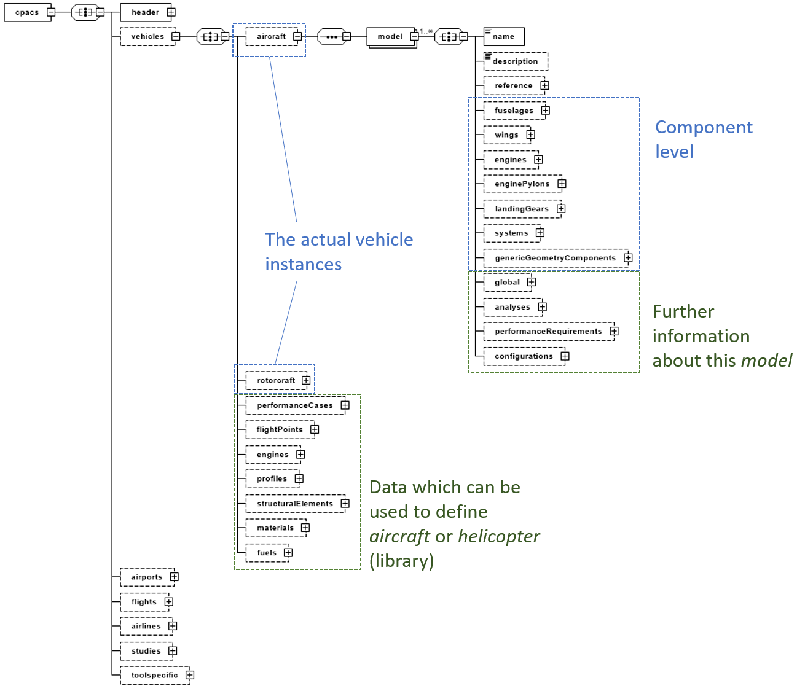
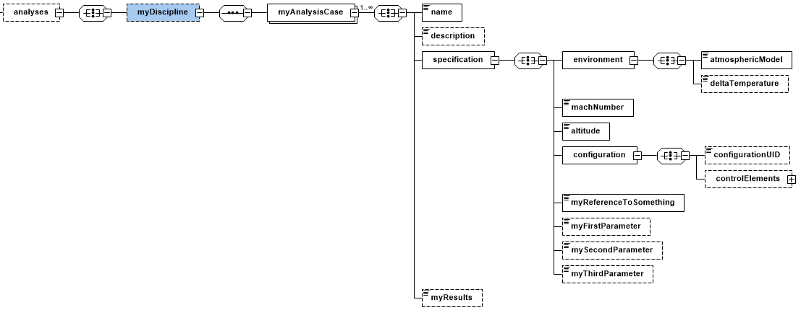
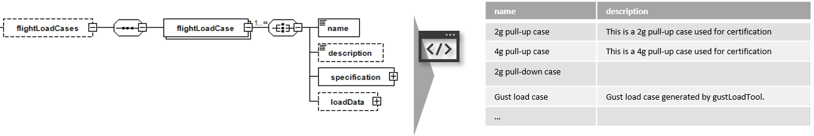
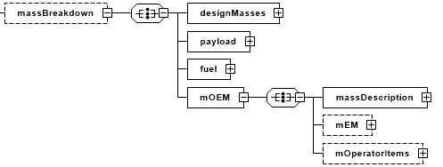
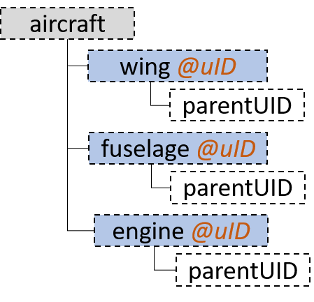

# CPACS Development Guidelines

## Redundancy
What do we mean by *redundancy*? Is the repeated specification of data such as `cpacs/vehicles/flightPoints/flightPoint` (atmosphere, altitude, velocity) critical if it would be included in an analysis node itself? A set of velocity/altitude itself is not a property dedicated to a specific `aircraft`/`rotorcraft` per se, thus making it a vehicle independent information would be reasonable. Therefore, (1st) the information could theoretically be outsourced to higher hierarchy levels (`cpacs` or `cpacs/vehicles`) and (2nd) a multiple specification of this information does not fall within the scope of data redundancy. Although the above example fulfills both requirements, should we always split the data into different hierarchical levels? To guide these decisions the following development guidelines should be applied: 

 - **§1: Vehicle-dependet information must follow the single-source-of-truth principle and must therefore be unique and explicit.**
 - **§2: (Vehicle-) independent information should be placed into higher hierarchical levels and linked via uID, if the definition is so complex or if it is used so frequently that the benefits from avoiding redefinitions and increasing consistency overweigh the increased complexity by splitting data and by the fact that the outsourced data must be processible by the linking elements.**

A good example for §2 is the `missionDefinition`. It is independent from a specific `model` and so complex that outsourcing it from `vehicles/aircraft/model` to `cpacs/vehicles/performanceCases` reduces redefinitions and therefore also increases consistency (*we are linking to the same, so we can be sure we are talking about the same*). However, all elements linking the mission definition (and thus all tools processing the linking elements) should be able to process the way these missions are defined via `segmentBlocks`, `segments`, parameter lapses and all the fancy things we have in the mission definition.

## Hierarchical classification of data

In cases where §2 applies, the question arises at which level data should be specified. It is no CPACS philosophy to enforce that *all repetitive elements are always defined in the plural singular form* (e.g., `wings/wing`). CPACS is rather following the System-of-Systems approach, thus going from overall system-of-systems level (e.g, `airports`, `fleets`, `vehicles`, etc.) to smaller and more detailed levels such as small components of an aircraft structure (e.g., `ribs`, `spars`). Therefore, a corresponding development guideline advices to treat the *plural containers* such as `vehicles` like a grouping element (e.g., *everything I want to relate to the system level `vehicle`*):

 - **§3: Plural elements in CPACS are intended to group all information belonging to the same thing at a specific system level.**

One thing to group under such a plural element is of course a list of multiple single instances (e.g., one to infinite `model`s, `wing`s and so on), but also all the information belonging to this element at the very system level. Examples in our system-of-systems approach are `vehicles`, `airports`, `airlines` and the corresponding information such as `flights` or `studies`. The `vehicle` as one part of the overall system-of-system is a group containing `aircraft`, `helicopter` as well as the corresponding information such as generic `profiles`, `materials` and so on. We could also group the latter under `aircraft` or `helicopter`, but from §2 we may conclude that the benefit of reusing these (sometimes called *library* elements) multiple times within `aircraft` and `helicopter` is large and so we group everything under `vehicles`.



## Naming conventions

- **..Point**: a fixed point in a finite parameter space; usually in spatial dimensions (e.g., `hingePoint`) or limited flight parameters (e.g., `flightPoint` comprising altitude and velocity). 
- **..Case**: used to describe combinations of complex parameter combinations such as analysis inputs/outputs (e.g., `loadCase`, `aeroCase`, `flyingQualityCase`...)
- **..Specification**: can be used within a *case* description (maybe in addition to a *point*) with more complex, individual information (e.g., `flightLoadCase/specification`)
- **..Requirement**: used for requirements, but can be reduced to **req** to avoid very long element names
- **environment**: This name should be used to refer to an `atmosphericModel` and `deltaTemperature` via the `environmentType`

The corresponding development guidelines is:

- **§4: Naming of elements should be done in accordance with naming conventions listed in the devepment guide.**

Furthermore, we should avoid using mathematical symbols or abbreviations as their meaning might differ between disciplines:

- **§5: Element names should be descriptive avoiding abbreviations or mathematical symbols if possible.**

## Units and coordinate systems

- **§6: Always use SI and accepted derived units.***
- **§7: Use the CPACS coordinate system for describing data (do not introduce new coordinate systems if not absolutely necessary).**

## Documentation of elements and attributes

Every element and every attribute carries an `xsd:annotation/xsd:documentation` text. It is the string a user sees next to the node in the generated documentation, so it should read as a caption for *that* node — not as a sentence about the schema. §8 to §13 below apply to elements and attributes alike; §14 adds what is specific to attributes.

- **§8: A documentation describes the node itself. It does not repeat the parent element, the enclosing type or the dataset.**

The path already tells the reader where the element sits, so restating it only adds noise. Where the surrounding context is stripped away and nothing meaningful is left, use the element name written out as a readable phrase.

| Avoid | Use |
| ---------- | ---------- |
| `Name of CPACS dataset` | `Name` |
| `Runways of the airport` | `Runways` |
| `Bolt of the attachment pin` | `Bolt` |
| `Profile geometries used by the models` | `Profiles` |
| `Single cargo cross beam` | `Cargo cross beam` |

The last row is a convention that was used in earlier releases and is no longer applied: a plural container groups its children by definition (see §3), so prefixing the child documentation with *Single* is redundant.

**This rule does not license shortening a documentation that carries real information.** Wherever an author explained a concept, a sign convention, a reference frame or an edge case, that text is the valuable part and must be kept:

> `compressedSuspensionTravel`: *Compressed suspension travel means the positive distance between the total length in airborne condition and the maximum reduced length due to maximum compression on the ground (e.g., landing shock).*

The same holds for a trailing phrase that distinguishes an element from its siblings. In `commandCases`, the elements `dp`, `dq` and `dr` are documented as *Command case for the roll / pitch / yaw rate command*; cutting the phrase after *Command case* would make all three identical and destroy the only information in the string.

- **§9: The `name` and `description` elements and the `uID` attribute are always documented as `Name`, `Description` and `UID`.**

Their meaning is defined once and for all in [*"name", "description" and "uID"*](#name-description-and-uid). Repeating the parent in every occurrence (`Name of the airline`, `Description of layer`, `UID of the pylon box.`) produces hundreds of variants of the same statement without adding anything. `uID` alone accounts for more than 200 occurrences.

- **§10: Documentation starts with a capital letter.**

The only exception is a text that opens with a code identifier, where capitalising would name a different element (`relPos ranges from 0 to 1 ...`). Prefer rewriting such a text so that it starts with a normal word.

- **§11: A full sentence ends with a period. A label does not.**

Decide by grammatical form, not by length. A noun phrase is a label and takes no period, however long it is; a clause with a subject and a finite verb is a sentence and takes one. Documentation consisting of several sentences ends with a period as well.

| Form | Example | Period |
| ---------- | ---------- | ---------- |
| Label (noun phrase) | `Cross section area` | no |
| Label with relative clause | `Height above the floor that is required to be empty of any objects` | no |
| Sentence | `The fuselage fuel tank geometry is defined by a link to a fuselage geometry compartment.` | yes |
| Several sentences | `Relative spanwise position. Eta refers to the segment or componentSegment depending on the referenced UID.` | yes |

- **§12: In running text, `UID` is written in capitals. `uID` refers to the XML attribute only.**

`uID` is the name of the attribute and is spelled that way when the attribute itself is meant, ideally in backticks. Used as a word — *"Reference to the UID of the analysed airfoil"* — it is an abbreviation and takes capitals.

- **§13: Physical units are given in square brackets at the end of the text, e.g. `Tilt angle of the bogie [deg]`.**

Write the unit as `[deg]`, `[m]`, `[N/m^2]`, and `[-]` for a dimensionless quantity — not as part of the prose (*"the angle (in deg) at which ..."*).

- **§14: Attributes are documented like elements. Where the same attribute name carries a different meaning in different types, each occurrence is documented for its own type.**

An attribute is easy to overlook because it is often written as a self-closing tag, but it reaches the user the same way an element does. Add the annotation as the first child, before any inline `xsd:simpleType`:

```XML
<xsd:attribute name="loftContinuity" type="loftContinuityType">
    <xsd:annotation>
        <xsd:documentation>Continuity used for lofting this component (default: C2 for fuselages and ducts, C0 for wings)</xsd:documentation>
    </xsd:annotation>
</xsd:attribute>
```

Note that a documentation placed inside a nested `xsd:enumeration` documents that *value*, not the attribute. Both are useful, but one does not replace the other.

The second half of §14 matters wherever a name was reused for unrelated concepts. `symmetry` is the example in the current schema:

| Type | Meaning |
| ---------- | ---------- |
| `stringUIDBaseType` | `Side of the referenced symmetric component (def, symm or full)` |
| `profileGeometry2DType` | `Symmetry of the profile (none, inherit, x-axis or y-axis)` |
| `wingType`, `fuselageType`, `ductType`, … | `Symmetry plane the component is mirrored at` |

- **§15: A type documentation does not introduce itself with its own type name. The `sd:schemaDoc/ddue:summary` names the type, the `ddue:remarks` explain it.**

The two blocks have different jobs, and neither of them needs the type name spelled out — the reader sees it in the schema and in the generated page heading.

| Avoid | Use |
| ---------- | ---------- |
| `Transformation type, containing a set of transformations` | `Set of transformations` |
| `AircraftAnalyses type, containing detailed analysis data of the aircraft` | `Detailed analysis data of the aircraft` |

Beyond being redundant, the prefix rots. It is copied along when a type is renamed or duplicated, and then states something false: `centerFuselageAreaType` claimed to be the *CenterFuselageAssembly type*, `skinSegmentType` the *FuselagePanel type*, and `flightsType` the *Flighs type*. A name that is written down twice will disagree with itself sooner or later.

Where removing the prefix leaves nothing but the summary repeated (*"Doors type, containing doors"*), the remarks block carried no information to begin with and should be dropped rather than rephrased.

Documentation that is missing, or that is a placeholder, is a defect like any other. A node whose meaning cannot be stated in one line is usually a sign that the node itself needs discussion.

## Code examples in the documentation

The remarks of a type can carry XML examples as `ddue:code` blocks, which the generator renders as captioned, highlighted code. An example is the most concrete statement the documentation makes about a node: readers — and AI assistants working from the schema — copy it rather than derive the data from the type definitions. §16 to §20 therefore treat an example like data: it has one form, a stated purpose, and it has to be correct.

- **§16: A code example is a `ddue:code` block with `language="XML"` and a `title`. The title is a label naming what the example shows.**

§10 and §11 apply to the title: it starts with a capital letter and, being a label, takes no period. Like a type documentation (§15), it does not introduce itself — the block is an example by definition. Where several examples form a series, the number is the one prefix that carries information.

| Avoid | Use |
| ---------- | ---------- |
| `Control parameter example` | `Control parameters in a control surface deflection path` |
| `Example of an engine pylon located only on the mirrored side of the wing.` | `Engine pylon located only on the mirrored side of the wing` |
| `title=" "`, or no title at all | `Point list with kinks and parameter map` |
| | `Example 3: invalid double vector due to comma separation` (one of a series) |

- **§17: The code is written in a CDATA section, not escaped. It starts at column 0 and is indented by four spaces per level.**

```XML
<ddue:para>Hence, some parts offer the option to set a <ddue:codeInline>symmetry</ddue:codeInline> attribute:</ddue:para>
<ddue:code language="XML" title="Symmetry attribute applied to a wing">
    <![CDATA[
<wing symmetry="x-z-plane">
    ...
</wing>
    ]]>
</ddue:code>
```

The schema is read in its raw form as often as in the generated documentation: in an editor, in a pull request, or as input to a language model. Escaped as `&lt;wing symmetry="x-z-plane"&gt;`, an example is no longer recognisable as XML there. Inside CDATA it reads exactly as in a CPACS file and can be copied out of the schema as it stands. The `<![CDATA[` and `]]>` markers follow the indentation of the schema, the code does not, so that its own indentation is preserved. The generator strips the blank lines around the code. Note that a CDATA section cannot contain the sequence `]]>`.

- **§18: A code block stands on its own — next to paragraphs, never inside a `ddue:para`.**

A `ddue:para` becomes an HTML paragraph, and an HTML paragraph cannot contain a code block: the browser closes the paragraph before the code, the text after it loses its paragraph, and the orphaned end tag adds an empty one. Close the paragraph with the sentence that introduces the example, place the code block after it, and continue in a new paragraph. The same holds for a `ddue:list` containing code blocks; directly inside a `ddue:listItem` or a `ddue:content`, a code block is in the right place.

| Avoid | Use |
| ---------- | ---------- |
| `<ddue:para>... e.g. a fuselage: <ddue:code>...</ddue:code></ddue:para>` | `<ddue:para>... e.g. a fuselage:</ddue:para>` followed by `<ddue:code>...</ddue:code>` |

- **§19: An XML example is well-formed and uses the element and attribute names of the current schema. Omitted content is written as `...`, and every element that is opened is closed.**

A fragment that stops after its start tag leaves the reader to guess where the element ends, and whoever reuses it — a person or an AI assistant — produces a broken file. `...` stands for everything that does not matter to the point being made:

```XML
<fuselage uID="ATTAS_fuselage">
    ...
</fuselage>
```

An example does not follow the schema by itself. Renaming an element includes searching the examples for the old name: before this rule was introduced, examples still used `CAS` and `continuitySetting` instead of `calibratedAirSpeed` and `continuity`, and `kinks` and `pointIndex` instead of `kinkIndices` and `pointIndices`, none of which the schema knew any longer.

Three cases are exempt. An example that deliberately shows invalid data says so in its title (`Example 4: invalid double vector due to string entry`). A placeholder name standing for any element of a type (`doubleVectorTest`) is fine where the surrounding text makes that clear. And an XML declaration (`<?xml version="1.0" encoding="utf-8"?>`) is only written where the example shows a complete file.

- **§20: The documentation shows data, not code. How to read or write a node with a library is shown in a script in `examples/python/`, which the documentation names and the tests run.**

Program code in the schema would make the documentation long, tie it to particular libraries, and could not be checked by the documentation generator, which runs nothing. A script in `examples/python/` can be run and is tested by `scripts/tests/test_examples.py`; the XML examples it uses stay in `examples/`. Where the documentation shows an excerpt of a file from `examples/`, the same test compares the two, so that neither changes without the other. The documentation of `toolspecificType` is the reference: it shows the tool data of `examples/toolspecific.xml` and the schema `examples/toolspecific_combined.xsd`, and names the scripts `examples/python/toolspecific_lxml.py` and `examples/python/toolspecific_tixi.py`.

## Figures and equations in the documentation

Figures and equations are images referenced from the schema with `ddue:mediaLink`/`ddue:image` and listed in `documentation/media.json` (see [Building the Documentation](buildDocumentation.md#figures)). The documentation generator renders neither formulas (`ddue:math`) nor plots itself, so both are produced beforehand. §21 to §25 apply to every new or reworked figure; existing figures are migrated when they are touched.

- **§21: A generated figure or equation is reproducible from source. The script lives in `documentation/scripts/`, is run with `uv run`, and is committed together with the images it writes.**

A figure that exists only as a PNG cannot be corrected, restyled or regenerated after a schema change. A script can. Each script declares its dependencies with pinned versions as [inline script metadata](https://packaging.python.org/en/latest/specifications/inline-script-metadata/), so `uv run documentation/scripts/<name>.py` from the repository root needs no further setup, and it writes byte-identical files when run again. Data shown in a figure is computed or read by the script, never typed in by hand. `documentation/scripts/cst2D.py` is the reference: it writes the figures and equations of `cst2DType` and the example file `examples/wingAirfoils_cst.xml`. Example files are written with the helpers in `documentation/scripts/example_xml.py`, so that all generated examples share one layout.

- **§22: Figures use the shared style in `documentation/scripts/figure_style.py`.**

The module sets the colors, line widths, fonts and output format below, so that all figures read as one family. A script imports it rather than defining its own values; a value that needs to change is changed in the module and in this table together.

| Role | Value | Use |
| ---------- | ---------- | ---------- |
| Series 1 | `#2a78d6` (blue) | first or only data series |
| Series 2 | `#d95926` (orange) | second series |
| Series 3 | `#199e70` (aqua) | third series, always with a text label |
| Series 1, light | `#86b6ef` | secondary marks of series 1, e.g. the terms of a sum drawn in series 1 |
| Ink | `#0b0b0b` | titles, labels, annotations |
| Secondary ink | `#52514e` | tick labels, secondary annotations |
| Muted | `#898781` | reference lines (e.g. a chord), leader lines, neutral comparison curves |
| Axis | `#c3c2b7` | axis lines and ticks |
| Grid | `#e1e0d9` | gridlines, where needed |
| Area wash | series color at 8 % opacity | the area enclosed by a curve |
| Lines | data 1.5 pt, secondary 1.0 pt, reference and axis 0.75 pt | solid, round caps and joins |
| Font | DejaVu Sans, 9 pt; titles 10 pt; annotations 8.5 pt | DejaVu Sans ships with matplotlib, so the output does not depend on installed fonts |
| Size | 7.6 in wide at 100 dpi nominal (760 px, the width of the detail pane), saved at 200 dpi | sharp on high-density screens |
| Background | transparent | the viewer places images on a light plate |

The series colors are validated as a categorical palette (lightness, chroma, separation under protanopia and deuteranopia, all pairs) against both plates the viewer uses, `#fefdfb` in the light and `#edeff1` in the dark theme. Series 1 and 2 reach at least 3:1 contrast on both; series 3 reaches 2.95:1 on the dark-theme plate and therefore always carries a text label. A figure needing more than three series is split into panels instead of adding colors.

- **§23: Color identifies, text explains. Text is set in ink, never in a series color, and identity never depends on color alone.**

Series colors are for marks: lines, markers, arrows, areas. Every label, value and legend entry uses ink or secondary ink, with a colored line key or a leader line next to it to show what it belongs to. Two or more series get a legend or a direct label for each series. To highlight one curve among alternatives, draw it in series 1 and the others in muted gray, each with a direct label. Leader lines share the muted gray, so a panel with gray curves identifies its labels by position or line key instead; a leader line there reads as one more curve.

| Avoid | Use |
| ---------- | ---------- |
| Label text in the series color | Label in ink with a colored line key |
| Dashed or dotted lines to tell series apart | Distinct colors or muted gray plus direct labels |
| Dashed gridlines or reference lines | Solid hairlines in muted or grid color |
| Top and right axis frame | Left and bottom axis only; a full frame only for zoomed detail views |

- **§24: Labels do not overlap each other, the data or the axes. Render the figure and look at it before committing.**

Collisions depend on the rendered text size and are not visible in the code. Check the image on both plate colors, `#fefdfb` and `#edeff1`. Move a label that collides to free space and connect it with a leader line; do not shrink it below the annotation size.

- **§25: An equation is written as LaTeX and rendered in Computer Modern. The `.tex` source is stored next to the image in `documentation/equations/`.**

`save_equation` in `figure_style.py` writes both files from the same lines, so source and image cannot diverge. It renders with matplotlib's mathtext, which needs no LaTeX installation and understands a large subset of LaTeX math (`\frac`, `\dfrac`, `\sum`, `\left(`…`\right)`, `\mathrm`); stay within that subset. Symbols inside the running text use `ddue:subscript` and `ddue:superscript` rather than an image. Write them so that no inline element directly follows another one or closes its parent (e.g. `B<ddue:subscript>0</ddue:subscript>²/2`, not `B<ddue:subscript>0</ddue:subscript><ddue:superscript>2</ddue:superscript>/2`): the schema formatter puts a line break after such an element, which is displayed as a space.

## Notes on TiGL

CPACS is a tool-independent standard, and its documentation defines what the data means. Most users, however, process the data with [TiGL](https://dlr-sc.github.io/tigl), and where TiGL reads valid data differently, they need to know. §26 to §28 keep the two apart.

- **§26: The normative text is tool-neutral. It describes what the data means, not how a tool reads it.**

A convention that TiGL established in practice is stated as a rule of CPACS, without naming TiGL. The sign of the lower CST coefficients is an example: it is written as the definition of `cst2DType`, not as TiGL behaviour.

- **§27: Where TiGL treats valid data differently, does not support it, or needs a workaround, a TiGL note says so. It is a `ddue:alert` with `class="tigl"`, names the TiGL version it was checked against, and is removed once TiGL follows the text.**

The generator sets the note apart from the text and labels it *TiGL*, so that readers can tell the standard from the state of its main tool at a glance. A note states only behaviour that was checked in a released TiGL version; features still under development in TiGL (at the time of writing, the approximation of point lists) get no note until their behaviour has settled. Place it in the remarks of the type, directly after the statement it qualifies; an element documentation (`xsd:documentation`) is plain text and cannot hold one. Where a TiGL issue exists, link it. A note that applies to no particular tool uses `class="note"` instead of a bold or italic "Note:".

```XML
<ddue:para>... the point indices start at 1.</ddue:para>
<ddue:alert class="tigl">
    <ddue:para>For interpolated fuselage profiles, TiGL 3.5 counts the kinkIndices ... from 0. ...</ddue:para>
</ddue:alert>
```

- **§28: A TiGL note describes how TiGL treats the data, not how to use TiGL. How to call TiGL belongs in the TiGL documentation.**

The parameters of TiGL's API functions are not CPACS parameters, even where they share a name: `xsi` in `tiglWingGetUpperPoint` is a surface parameter by default, not the relative chord position CPACS calls `xsi`. Explaining the API in the schema would mix the two.

| Avoid | Use |
| ---------- | ---------- |
| "TiGL interprets the lower coefficients with a negative sign." | The sign convention as definition of the type, without TiGL (§26) |
| A TiGL remark inside a normative paragraph | A separate `ddue:alert class="tigl"` after it |
| "TiGL does not support this." | "TiGL 3.5 does not support this." |
| "Use tiglWingSetGetPointBehavior(onLinearLoft) to …" | Nothing in the schema; a hint in the TiGL documentation |

## Development Guidelines by Example

### Example analysis node

The figure below shows an example of a typical analysis node. A complete analysis case is summarized with `case`. There is no need for a plural parent element `..Cases` if there exists no alternatives. In other words, if `myDiscipline` groups different analysis cases, a plural parent element should be applied (e.g., `flightDynamics`, `trimCases`, `controllabilityCases`, etc.). In addition to a `uID` attribute as well as the usual `name` (obligatory) and `description` (optinoal) elements, a `case` consists of two parts. 

The first part should be labelled as `specification` and contains the input parameters for the corresponding analysis (since these may represent an output for other disciplines, the name `input` should be avoided at this point; also the term `definition` is a bit too imprecise). There are a few typical elements which should be reused for the specification if it makes sense. This includes an `environment` element of type `environmentType`, which provides an `atmosphericModel` and a corresponding `deltaTemperature`. A node named `configuration` of type `configurationType` provides a `uID` reference to predefined configurations as well as additional individual control devices that can be superposed to this configuration. This set of inputs might be further enriched by own parameters such as `uID` references to existing components or individual parameters based on the simple `baseTypes`. 

The second part contains the actual analysis data and its name should distinguish between `Data` (e.g., `aeroData`, `loadData`) and `Map` (e.g., `aeroPerformanceMap`, `enginePerformanceMap`). 



### "name", "description" and "uID"

The `name` and `description` elements as well as the `uID` attribute are available for referencing and describing new CPACS nodes. The basic meaning of these elements is as follows:

- **name**: A specification of a mandatory name element should be used for sequences of elements (e.g., if max occurrence is unbounded [1..\*]). Typical examples are `wings/wing`, `aeroPerformance/aeroMap` or `missions/mission`. Tools should be able to list these nodes, especially for visualization and reporting purposes. Here, the `name` element serves as a **concise and human-readable** indicator of the actual meaning of the corresponding element in the list (e.g., which `wing`, which `aeroMap`, which `mission`). This is usually a single word or a small number of words.

- **description**: This element should be used as optional occurrence to allow users to add **comprehensive and human-readable** explanations. This is usually at least one explanatory sentence.

    - Example 1: The `loadCases` are an indefinite sequence of elements and should therefore contain a `name` and `description` element. A tool might parse and generate a human-readable list from this:
      
      

    - Example 2: In cases like the `massBreakdown`, the parent element (e.g., `mOEM`) exists only once. An additional `name` element is superfluous at this point, since this is explicitly given via the parameter name (`mOEM`). The use of the `description` element can nevertheless be useful in some cases (not existing in the following example figure; not to be confused with `massDescription`).
       
      
      

- **uID**: The `uID` attribute should be mainly used for internal referencing of CPACS elements. Nevertheless, further processing software, e.g. *TiXI* and *TiGL*, also use the uIDs to improve the robustness of the data query. Consequently, the uID attribute should serve as a **machine-readable** indicator and does not claim to be interpretable by human users. It should be mandatory whenever it is clear that the node is highly likely to be linked CPACS internally. If linking via `uID` should potentially be possible but will not use this very often, then the `uID` attribute should be set as optional. It is important to note that the content of the `uID` string is not standardized for the reasons mentioned previously, and tool developers should therefore be advised to refrain from hard-wired `uID` parsing routines (e.g., routines that search for `uID="htp"`). 

### ParentUID

CPACS is a hierarchical data model. There are two approaches to setting up this hierarchy: (1) by the native parent-child relationship of elements in XML and (2) by specifying the hierarchy using the `parentUID` element. 


| (1) XML hierarchy | (2) Hierarchy via `parentUID` |
| ---------- | ---------- |
|  | |
| <ul><li>(+) explicit and clear data structure</li><li>(+) user-friendly, intuitive</li><li>(-) difficult to realize varying hierarchies, e.g. via choice elements</li></ul> | <ul><li>(+) flexibility for the user </li><li>(-) high risk of incorrect use, since there must always be a top-level main element in a hierarchy. Consequently, the user must specify exactly one element without parentUID, but all others with parentUID. This condition cannot be checked via XSD. </li></ul> |
| **prefer if**: the hierarchy is clear in advance and should not be changed by the user | **prefer if**: the hierarchy cannot be defined in advance and the flexibility should be left to the user |

#### Combination of `parentUID` and `transformation`
From a geometric point of view, the goal of the hierarchical representation is also the placement of the local coordinate systems. Therefore, the `parentUID` element is usually used in combination with the `transformation` node. The latter should contain the `refType` attribute, which explicitly specifies whether the transformation of the local coordinate system refers to the global coordinate system (`absGlobal`) or the local (parent) coordinate system (`absLocal`) as an absolute value.

**Note**: In current CPACS releases the `refType` attribute can only be used for the `translation` node. For new developments, it should be checked whether the `transformation` element itself can carry the `refType` attribute, since it not only contains `translation` but also `rotation`.

**Important**: Make sure that it is described in detail via the documentation how to interpret the specification of the hierarchical coordinate system placement (e.g., what is default value; describe different cases, etc.)!


### Duplication vs Single Type Reference vs Hidden Changes
Let us discuss different approaches at the example of introducing a second option for specifying internal wing points by using segment eta xsi coordinates.
This related to issue https://github.com/DLR-LY/CPACS/issues/495.

In principle I see three different possibilities to implement the two options.

1. add an additional segmentUID node next to eta and xsi. THen, whenever a segmentUID is given the eta and xsi nodes should be interpreted as segment eta xsi coordinates.
  ```XML
  <parentNode>
    <eta />
    <xsi />
    <segmentUID /> <!-- optional -->
  </parentNode>
```
2. add the option as a choice between [eta, xsi] or [etaSeg, xsiSeg, segmentUID]
  ```XML
  <parentNode>
    <!-- choice 1 start-->
    <eta />
    <xsi />
    <!-- choice 1 end -->
    <!-- choice 2 -->
    <etaSeg />
    <xsiSeg />
    <segmentUID />
    <!-- choice 2 end -->
  </parentNode>
```
3. combine both options as described in 2. into their own parent node
  ```XML
  <parentNode>
    <!-- choice 1 start-->
    <componentSegmentPoint>
      <eta />
      <xsi />
    </componentSegmentPoint>
    <!-- choice 1 end -->
    <!-- choice 2 -->
    <segmentPoint>
      <eta />
      <xsi />
      <segmentUID />
    </segmentPoint>
    <!-- choice 2 end -->
  </parentNode>
```

Option 1. is clearly a very reduced approach. It allows the user of the data to switch the interpretation of the eta and xsi nodes depending on the existence of the segmentUID node. A risk of this approach is that without modifications, existing tools might miss the additional segmentUID node and thus misinterpret the point.
Option 2. avoids misinterpreting the segment eta xsi values by giving them a different node name. But the drawback is the additional nodes (node names) which need to be processed.
Option 3. is very similar to option 2. but keeps eta xsi as the names also for segment eta xsi coordinates and creates an additional intermediate node for both options. This opens up the opportunity to create separate types for both options which can be reused at several locations throughout the schema. This would minimize the effort in case changes are required for the definition of the points and ensures some consistency in the use of eta xsi points. E.g. if we had an etaXsiPointType for componentSegment points we could find all uses throughout the schema to implement the segment coordinate alternative. Also creating an additional type allows us to use xsd:all within the type definition which otherwise would not be possible due to the xsd:choice.


### Favor compact solutions
... if feasible

For point clouds such as used in wing profiles in early CPACS versions a point definition with x,y and z coordinate was used for every profile point.

```XML
<points>
  <point uID="p1">
    <x>0.0</x>
    <y>0.0</y>
    <z>0.0</z>
  </point>
  <point uID="p2">
    <x>1.0</x>
    <y>0.0</y>
    <z>0.0</z>
  </point>
  <point uID="p3">
    <x>1.0</x>
    <y>0.0</y>
    <z>1.0</z>
  </point>
  <point uID="p4">
    <x>0.0</x>
    <y>0.0</y>
    <z>1.0</z>
  </point>
  <point uID="p5">
    <x>0.0</x>
    <y>0.0</y>
    <z>0.5</z>
  </point>
  <point uID="p6">
    <x>0.0</x>
    <y>0.0</y>
    <z>0.0</z>
  </point>
</points>
```

In this case the overhead of data due to the tags was much higher than the actual data to be exchanged. Thus it was changed to a more compact definition:

```XML
<pointList>
  <x>0.0;1.0;1.0;0.0;0.0;0.0</x>
  <y>0.0;0.0;0.0;0.0;0.0;0.0</y>
  <z>0.0;0.0;1.0;1.0;0.5;0.0</z>
</pointList>
```
