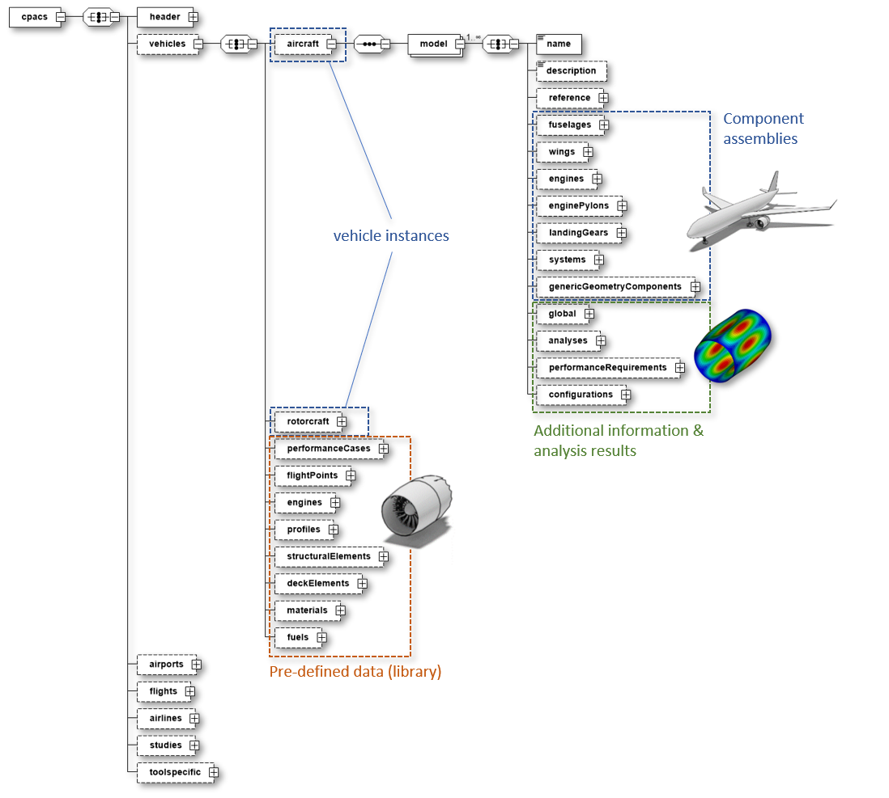
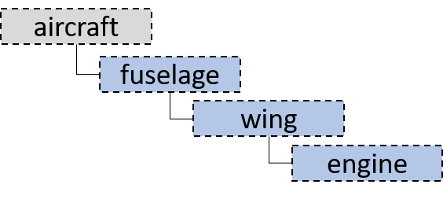

# CPACS Development Guidelines

## Redundancy
What do we mean by *redundancy*? Is the repeated specification of data such as `cpacs/vehicles/flightPoints/flightPoint` (atmosphere, altitude, velocity) critical if it would be included in an analysis node itself? A set of velocity/altitude itself is not a property dedicated to a specific `aircraft`/`rotorcraft` per se, thus making it a vehicle independent information would be reasonable. Therefore, (1st) the information could theoretically be outsourced to higher hierarchy levels (`cpacs` or `cpacs/vehicles`) and (2nd) a multiple specification of this information does not fall within the scope of data redundancy. Although the above example fulfills both requirements, should we always split the data into different hierarchical levels? To guide these decisions the following development guidelines should be applied: 

 - **§1: Vehicle-dependet information must follow the single-source-of-truth principle and must therefore be unique and explicit.**
 - **§2: (Vehicle-) independent information should be placed into higher hierarchical levels and linked via uID, if the definition is so complex or if it is used so frequently that the benefits from avoiding redefinitions and increasing consistency overweigh the increased complexity by splitting data and by the fact that the outsourced data must be processible by the linking elements.**

A good example for §2 is the `missionDefinition`. It is independent from a specific `model` and so complex that outsourcing it from `vehicles/aircraft/model` to `cpacs/vehicles/performanceCases` reduces redefinitions and therefore also increases consistency (*we are linking to the same, so we can be sure we are talking about the same*). However, all elements linking the mission definition (and thus all tools processing the linking elements) should be able to process the way these missions are defined via `segmentBlocks`, `segments`, parameter lapses and all the fancy things we have in the mission definition.

## Hierarchical classification of data

In cases where §2 applies, the question arises at which level data should be specified. It is no CPACS philosophy to enforce that *all repetitive elements are always defined in the plural singular form* (e.g., `wings/wing`). CPACS is rather following the System-of-Systems approach, thus going from overall system-of-systems level (e.g, `airports`, `fleets`, `vehicles`, etc.) to smaller and more detailed levels such as small components of an aircraft structure (e.g., `ribs`, `spars`). Therefore, a corresponding development guideline advices to treat the *plural containers* such as `vehicles` like a grouping element (e.g., *everything I want to relate to the system level `vehicle`*):

 - **§3: Plural elements in CPACS are intended to group all information belonging to the same thing at a specific system level.**

One thing to group under such a plural element is of course a list of multiple single instances (e.g., one to infinite `model`s, `wing`s and so on), but also all the information belonging to this element at the very system level. Examples in our system-of-systems approach are `vehicles`, `airports`, `airlines` and the corresponding information such as `flights` or `studies`. The `vehicle` as one part of the overall system-of-system is a group containing `aircraft`, `helicopter` as well as the corresponding information such as generic `profiles`, `materials` and so on. We could also group the latter under `aircraft` or `helicopter`, but from §2 we may conclude that the benefit of reusing these (sometimes called *library* elements) multiple times within `aircraft` and `helicopter` is large and so we group everything under `vehicles`.



## Naming conventions

- **..Point**: a fixed point in a finite parameter space; usually in spatial dimensions (e.g., `hingePoint`) or limited flight parameters (e.g., `flightPoint` comprising altitude and velocity). 
- **..Case**: used to describe combinations of complex parameter combinations such as analysis inputs/outputs (e.g., `loadCase`, `aeroCase`, `flyingQualityCase`...)
- **..Specification**: can be used within a *case* description (maybe in addition to a *point*) with more complex, individual information (e.g., `flightLoadCase/specification`)
- **..Requirement**: used for requirements, but can be reduced to **req** to avoid very long element names
- **environment**: This name should be used to refer to an `atmosphericModel` and `deltaTemperature` via the `environmentType`

The corresponding development guidelines is:

- **§4: Naming of elements should be done in accordance with naming conventions listed in the devepment guide.**

Furthermore, we should avoid using mathematical symbols or abbreviations as their meaning might differ between disciplines:

- **§5: Element names should be descriptive avoiding abbreviations or mathematical symbols if possible.**

## Units and coordinate systems

- **§6: Always use SI and accepted derived units.***
- **§7: Use the CPACS coordinate system for describing data (do not introduce new coordinate systems if not absolutely neccessary).**

## Development Guidelines by Example

### Example analysis node

The figure below shows an example of a typical analysis node. A complete analysis case is summarized with `case`. There is no need for a plural parent element `..Cases` if there exists no alternatives. In other words, if `myDiscipline` groups different analysis cases, a plural parent element should be applied (e.g., `flightDynamics`, `trimCases`, `controllabilityCases`, etc.). In addition to a `uID` attribute as well as the usual `name` (obligatory) and `description` (optinoal) elements, a `case` consists of two parts. 

The first part should be labeld as `specification` and contains the input parameters for the corresponding analysis (since these may represent an output for other disciplines, the name `input` should be avoided at this point; also the term `definition` is a bit too imprecise). There are a few typical elements which should be reused for the specification if it makes sense. This includes an `environment` element of type `environmentType`, which provides an `atmosphericModel` and a corresponding `deltaTemperature`. A node named `configuration` of type `configurationType` provides a `uID` reference to predefined configurations as well as additional individual control devices that can be superposed to this configuration. This set of inputs might be further enriched by own parameters such as `uID` references to existing components or individual parameters based on the simple `baseTypes`. 

The second part contains the actual analysis data and its name should distinguish between `Data` (e.g., `aeroData`, `loadData`) and `Map` (e.g., `aeroPerformanceMap`, `enginePerformanceMap`). 


### "name", "description" and "uID"

The `name` and `description` elements as well as the `uID` attribute are available for referencing and describing new CPACS nodes. The basic meaning of these elements is as follows:

- **name**: A specification of a mandatory name element should be used for sequences of elements (e.g., if max occurence is unbounded [1..\*]). Typical examples are `wings/wing`, `aeroPerformance/aeroMap` or `missions/mission`. Tools should be able to list these nodes, especially for visualization and reporting purposes. Here, the `name` element serves as a **concise and human-readable** indicator of the actual meaning of the corresponding element in the list (e.g., which `wing`, which `aeroMap`, which `mission`). This is usually a single word or a small number of words.

- **description**: This element should be used as optional occurence to allow users to add **comprehensive and human-readable** explanations. This is usually at least one explanatory sentence.

    - Example 1: The `loadCases` are an indefinite sequence of elements and should therefore contain a `name` and `description` element. A tool might parse and generate a human-readable list from this:
      
      

    - Example 2: In cases like the `massBreakdown`, the parent element (e.g., `mOEM`) exists only once. An additional `name` element is superfluous at this point, since this is explicitly given via the parameter name (`mOEM`). The use of the `description` element can nevertheless be useful in some cases (not existing in the following example figure; not to be confused with `massDescription`).
       
      
      

- **uID**: The `uID` attribute should be mainly used for internal referencing of CPACS elements. Nevertheless, further processing software, e.g. *TiXI* and *TiGL*, also use the uIDs to improve the robustness of the data query. Consequently, the uID attribute should serve as a **machine-readable** indicator and does not claim to be interpretable by human users. It should be mandatory whenever it is clear that the node is highly likely to be linked CPACS internally. If linking via `uID` should potentially be possible but will not use this very often, then the `uID` attribute should be set as optional. It is important to note that the content of the `uID` string is not standardized for the reasons mentioned previously, and tool developers should therefore be advised to refrain from hard-wired `uID` parsing routines (e.g., routines that search for `uID="htp"`). 

### ParentUID

CPACS is a hierarchical data model. There are two approaches to setting up this hierarchy: (1) by the native parent-child relationship of elements in XML and (2) by specifying the hierarchy using the `parentUID` element. 


| (1) XML hierarchy | (2) Hierarchy via `parentUID` |
| ---------- | ---------- |
|  | |
| <ul><li>(+) exlicit and clear data structure</li><li>(+) user-friendly, intuitive</li><li>(-) difficult to realize varying hierarchies, e.g. via choice elements</li></ul> | <ul><li>(+) flexibility for the user </li><li>(-) high risk of incorrect use, since there must always be a top-level main element in a hierarchy. Consequently, the user must specify exactly one element without parentUID, but all others with parentUID. This condition cannot be checked via XSD. </li></ul> |
| **prefer if**: the hierarchy is clear in advance and should not be changed by the user | **prefer if**: the hierarchy cannot be defined in advance and the flexibility should be left to the user |

#### Combination of `parentUID` and `transformation`
From a geometric point of view, the goal of the hierarchical representation is also the placement of the local coordinate systems. Therefore, the `parentUID` element is usually used in combination with the `transformation` node. The latter should contain the `refType` attribute, which explicitly specifies whether the transformation of the local coordinate system refers to the global coordinate system (`absGlobal`) or the local (parent) coordinate system (`absLocal`) as an absolute value.

**Note**: In current CPACS releases the `refType` attribute can only be used for the `translation` node. For new developments, it should be checked whether the `transformation` element itself can carry the `refType` attribute, since it not only contains `translation` but also `rotation`.

**Important**: Make sure that it is described in detail via the documentation how to interpret the specification of the hierarchical coordinate system placement (e.g., what is default value; describe different cases, etc.)!


### Duplication vs Single Type Reference vs Hidden Changes
Let us discuss different approaches at the example of introducing a second option for specifying internal wing points by using segment eta xsi coordinates.
This related to issue https://github.com/DLR-LY/CPACS/issues/495.

In principle I see three different possibilities to implement the two options.

1. add an additional segmentUID node next to eta and xsi. THen, whenever a segmentUID is given the eta and xsi nodes should be interpreted as segment eta xsi coordinates.
  ```XML
  <parentNode>
    <eta />
    <xsi />
    <segmentUID /> <!-- optional -->
  </parentNode>
```
2. add the option as a choice between [eta, xsi] or [etaSeg, xsiSeg, segmentUID]
  ```XML
  <parentNode>
    <!-- choice 1 start-->
    <eta />
    <xsi />
    <!-- choice 1 end -->
    <!-- choice 2 -->
    <etaSeg />
    <xsiSeg />
    <segmentUID />
    <!-- choice 2 end -->
  </parentNode>
```
3. combine both options as described in 2. into their own parent node
  ```XML
  <parentNode>
    <!-- choice 1 start-->
    <componentSegmentPoint>
      <eta />
      <xsi />
    </componentSegmentPoint>
    <!-- choice 1 end -->
    <!-- choice 2 -->
    <segmentPoint>
      <eta />
      <xsi />
      <segmentUID />
    </segmentPoint>
    <!-- choice 2 end -->
  </parentNode>
```

Option 1. is clearly a very reduced approach. It allows the user of the data to switch the interpretation of the eta and xsi nodes depending on the existence of the segmentUID node. A risk of this approach is that without modifications, existing tools might miss the additional segmentUID node and thus misinterpret the point.
Option 2. avoids misinterpreting the segment eta xsi values by giving them a different node name. But the drawback is the additional nodes (node names) which need to be processed.
Option 3. is very similar to option 2. but keeps eta xsi as the names also for segment eta xsi coordinates and creates an additional intermediate node for both options. This opens up the opportunity to create separate types for both options which can be reused at several locations throughout the schema. This would minimize the effort in case changes are required for the definition of the points and ensures some consistency in the use of eta xsi points. E.g. if we had an etaXsiPointType for componentSegment points we could find all uses throughout the schema to implement the segment coordinate alternative. Also creating an additional type allows us to use xsd:all within the type definition which otherwise would not be possible due to the xsd:choice.


### Favor compact solutions
... if feasible

For point clouds such as used in wing profiles in early CPACS versions a point definition with x,y and z coordinate was used for every profile point.

```XML
<points>
  <point uID="p1">
    <x>0.0</x>
    <y>0.0</y>
    <z>0.0</z>
  </point>
  <point uID="p2">
    <x>1.0</x>
    <y>0.0</y>
    <z>0.0</z>
  </point>
  <point uID="p3">
    <x>1.0</x>
    <y>0.0</y>
    <z>1.0</z>
  </point>
  <point uID="p4">
    <x>0.0</x>
    <y>0.0</y>
    <z>1.0</z>
  </point>
  <point uID="p5">
    <x>0.0</x>
    <y>0.0</y>
    <z>0.5</z>
  </point>
  <point uID="p6">
    <x>0.0</x>
    <y>0.0</y>
    <z>0.0</z>
  </point>
</points>
```

In this case the overhead of data due to the tags was much higher than the actual data to be exchanged. Thus it was changed to a more compact definition:

```XML
<pointList>
  <x>0.0;1.0;1.0;0.0;0.0;0.0</x>
  <y>0.0;0.0;0.0;0.0;0.0;0.0</y>
  <z>0.0;0.0;1.0;1.0;0.5;0.0</z>
</pointList>
```
